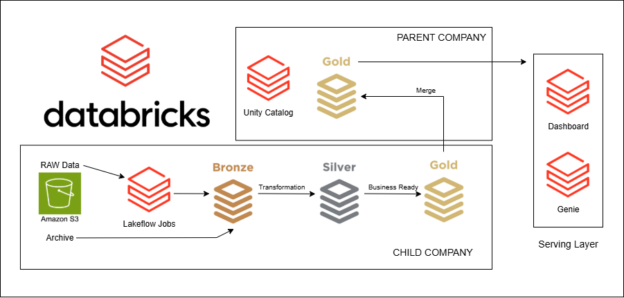

# 🏗️ FMCG Data Engineering Project (Lakehouse Architecture with Databricks)

## 📌 Overview
This project is an **end-to-end data engineering pipeline** built using the **Databricks Free Edition**, designed for both beginners and advanced practitioners.

The use case is based on a real-world **FMCG (Fast-Moving Consumer Goods)** scenario where a large retail company acquires a smaller company. The objective is to **consolidate data from both organizations into a unified lakehouse architecture** for analytics and reporting.

---

## 🎯 Business Problem
When companies merge, their data systems are often fragmented. This project solves:

- Data inconsistency across systems  
- Lack of centralized reporting  
- Difficulty in generating business insights  

**Solution:** Build a scalable ETL pipeline that integrates and transforms data into a single source of truth.

---

## 🏗️ Architecture

---

## 🔄 Pipeline Flow:

1. **Data Ingestion**
    - Upload raw datasets to Amazon S3
    - Connect S3 to Databricks
    - Load into Bronze layer
2. **Data Transformation**
    - Clean and standardize data
    - Process dimension tables
    - Align schemas across companies
3. **Fact Processing**
    - Historical Load
    - Initial full load
    - Incremental Load
    - Ongoing updates
4. **Data Modeling**
    - Build fact and dimension tables
    - Optimize for analytical queries
5. **Orchestration**
    - Automate workflows within Databricks
6. **Serving Layer**
    - Create denormalized Gold tables
    - Enable fast querying via Genie
7. **Visualization**
    - Build dashboards for business insights

---

## 📈 Key Features
- End-to-end ETL pipeline
- Real-world FMCG acquisition use case
- Medallion architecture implementation
- Incremental data processing
- Scalable lakehouse design

---

## 🧠 Key Learnings
- Databricks + Spark pipeline development
- Medallion architecture in practice
- Data consolidation strategies
- Incremental ETL design
- Analytics-ready data modeling

---

## 🔮 Future Improvement
- CI/CD pipeline integration
- Data quality checks (e.g., Great Expectations)
- Streaming pipelines (Kafka / Spark Streaming)
- Cloud deployment (AWS / Azure / GCP)

---

## 📺 Reference
- Codebasics Databricks End-to-End Data Engineering Project
- Link: https://www.youtube.com/watch?v=U6ZUKWdfSLY&list=WL&index=13
